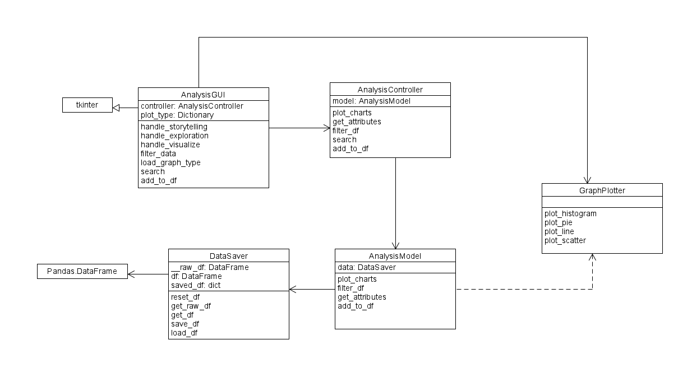

# Steam Game Market Analysis

## Instructions
### Setup
1. check for python version

    `python --version` 
    python version should be newer than 3.11
2. check for pip installation   `python -m pip --version`  
   pip must be installed in order to install the required package

### How to Run

1. Install required package ``pip install -r requirements.txt``
2. Run the main module ``python main.py``

#### Workaround for some problem
- tkinter does not install
  - Linux 
    
    ``sudo apt-get install python3-tk``
  - MacOS   
    ``brew install python-tk``

## Required Packages
###### same as requirement.txt
- matplotlib>=3.8.4
- numpy>=1.26.4
- pandas>=2.2.2
- Pillow>=10.3.0
- Requests>=2.31.0

## UML Diagram

