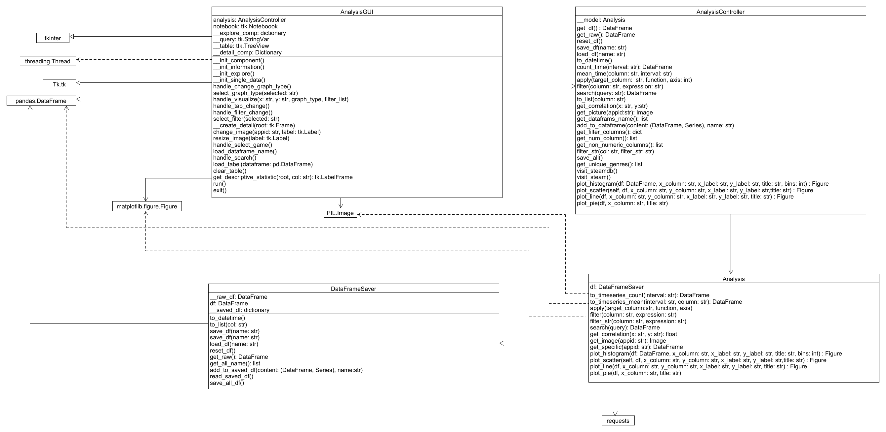

# Steam Game Market Analysis

## Description
This application summarizes information about the video game market based on data from the Steam store. It provides users with tools to explore the data through:

* **Plotting graphs:** Visualize trends and relationships in the data.
* **Viewing specific video game details:** Get in-depth information about individual games.

----

## Instructions
### Setup
1. **check for python version :** 
    `python --version` 
   Ensure you have Python version 3.11 or newer installed. If not, install or update Python to meet this requirement.
2. **check for pip installation:**   `python -m pip --version`  
   pip (the Python package manager) is necessary for installing required packages. 

### How to Run

1. **Install required package :**  ``pip install -r requirements.txt``  
This command installs all the necessary packages listed in the requirements.txt file.
2. **Run the main module :**``python main.py``

----

#### Workaround for tkinter missing Issues
  - Linux 
    ``sudo apt-get install python3-tk``
  - MacOS   
    ``brew install python-tk``
These commands install the `tkinter` package required for 
the application's graphical user interface (GUI) on specific operating systems.

----

## Required Packages
###### same as ``requirement.txt``
- matplotlib>=3.8.4
- numpy>=1.26.4
- pandas>=2.2.2
- Pillow>=10.3.0
- Requests>=2.31.0

## UML Diagram
### UML Class Diagram

### Sequence Diagram

---
### DataSource
The data used in this application originates from the Steam Games Dataset on Kaggle: 
[Kaggle.com](https://www.kaggle.com/datasets/fronkongames/steam-games-dataset?select=games.csv)
  The dataset is licensed under the MIT License (see [THIRD-PARTY-LICENSE](THIRD-PARTY-LICENSE) for details).

----